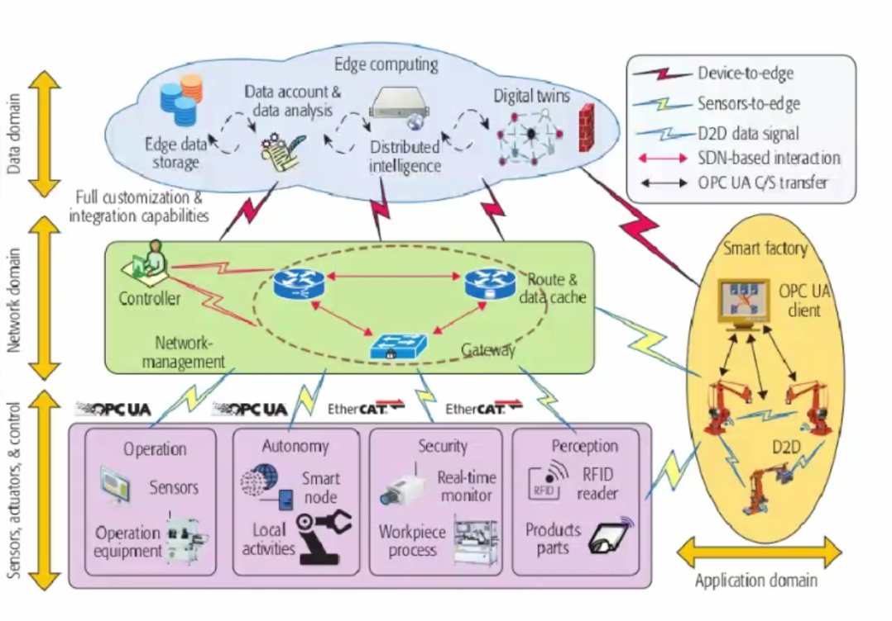
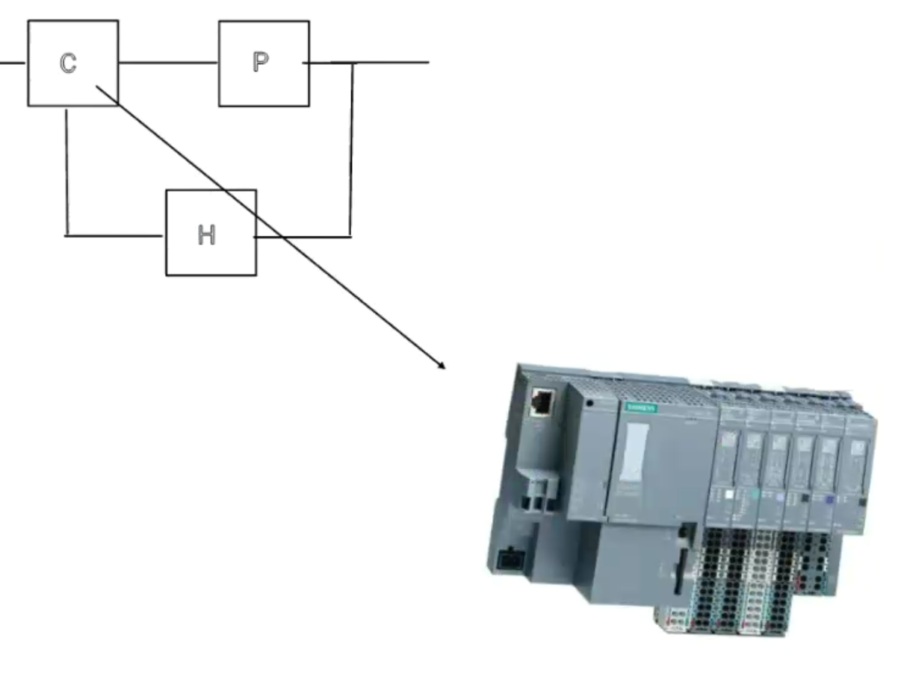
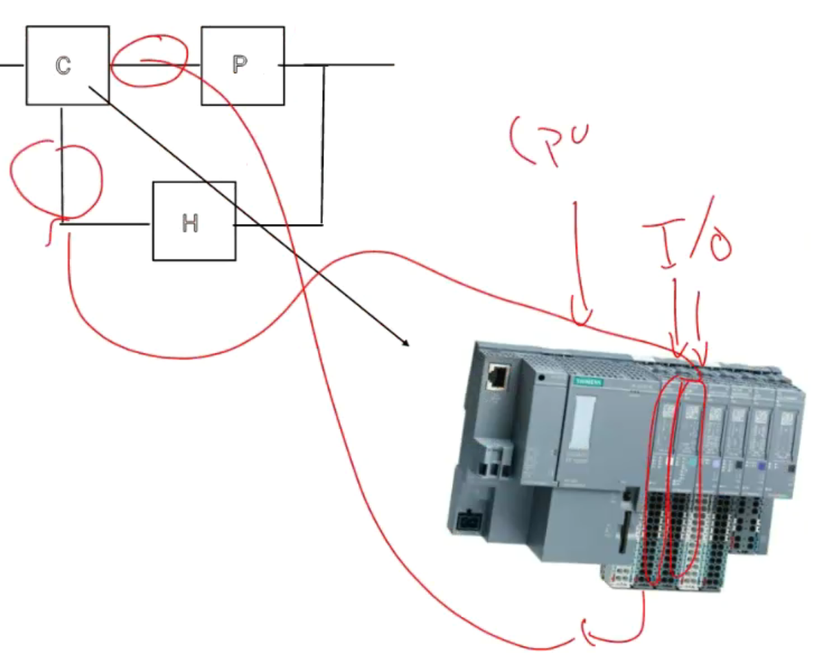
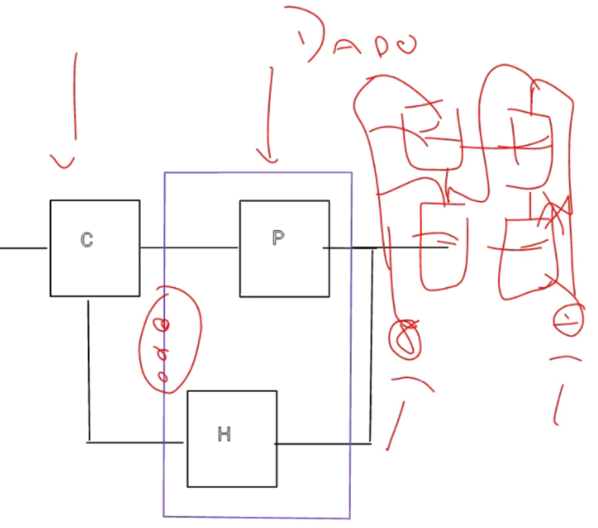
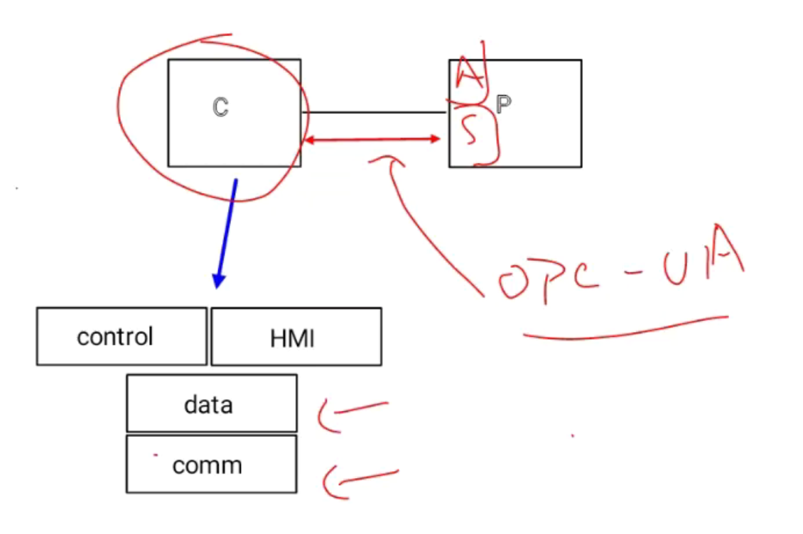
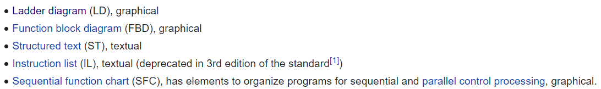

# Process control and OPC UA

## Cyber-physical systems

- Data domain
  - Databases, analytics, distribution, digital twins
- Network domain
  - User control, network management, routing
- Field domain
  - Plants, sensors

Cyber-physical systems have three main requirements:

- They're *scalable*
  - More components can be added without impacting system performance
- They're *interoperable*
  - No dependence on specific vendors' equipment
- ??? Profit ???
  - Creo que era seguridad

The OPC UA standard interfaces the field layer with the network domain with the main goal of enabling scalability and interoperability.

In real processes, every single element of the classical control loop needs a realizable implementation, and as process engineers, we can **only** design the controller $\mathbb{C}$. $\mathbb{P}$ and $\mathbb{H}$ come given by the plant and sensor systems.

A PLC (programmable logic controller) is a relatively straightforward way of interfacing with the real buses of the system:

A PLC is just a computer, albeit specifically designed for fast response times and with some basic communication protocols already implemented. OPC UA defines the connections between the outgoing controller-plant connection and the incoming sensor-controller connection.

The controller we will develop in this lab has no idea that the plant is simulated, as it's interfacing through the common OPC UA standard. This means that we can easily plug it into a real system and begin controlling it!

Our controller will be modern in the sense that it will include an HMI (Human-Machine Interface).

Since human time constants are far slower than those of the controlled processes, the control-data-communication subloop needs to be highly reliable and in *real time* so as to avoid delays as much as possible. A good controller will respond within 10ms, but a human will take sometimes 100x as long. Delays in the HMI **are acceptable** as long as the process itself suffers no performance impact.

## Extras

There are 5 main languages to program PLCs, and the most used one through history is with *ladder logic*. Nowadays it's becoming more common to directly incorporate SimuLink systems!

The [IEC61131-3](https://en.wikipedia.org/wiki/IEC_61131-3) standard gives the *de facto* machine code compatible with PLCs, and many compilers exist from different languages to this.